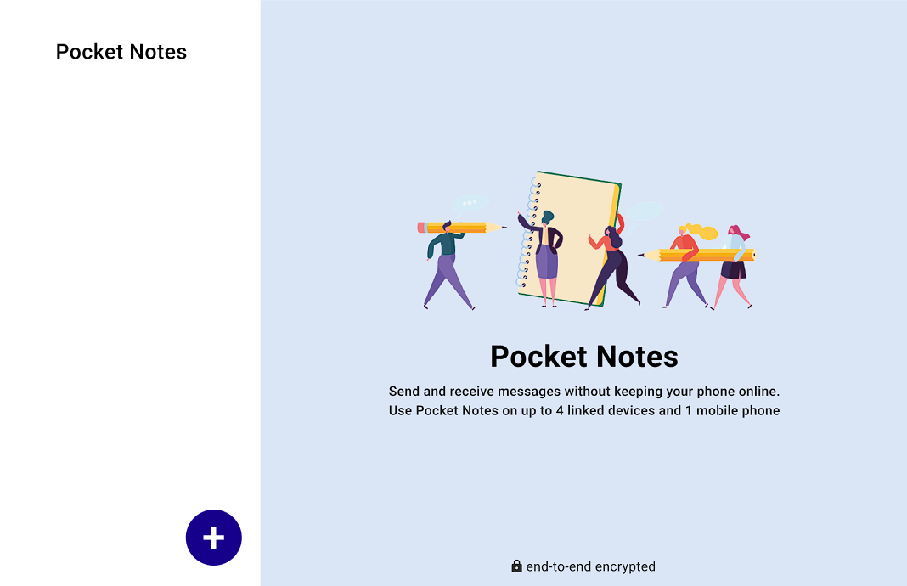
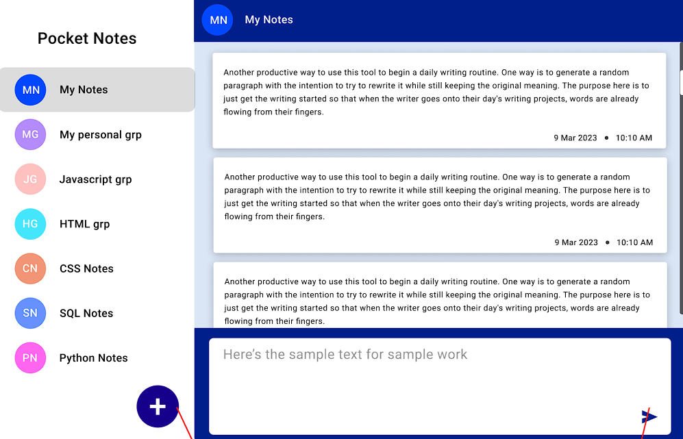

# `Notes-App  `

  + [Click Here](https://satishshinde2048.github.io/Notes-App/) to see my Notes App 
  website.

## `Project Structure`

```
pocket-notes-app/
├── src/
│   ├── components/
│   │   ├── Sidebar/
│   │   │   ├── Sidebar.jsx
│   │   │   └── Sidebar.module.css
│   │   ├── GroupPopup/
│   │   │   ├── GroupPopup.jsx
│   │   │   └── GroupPopup.module.css
│   │   └── NotesArea/
│   │       ├── NotesArea.jsx
│   │       └── NotesArea.module.css
│   ├── assets/
│   │   └── InitialImg.png
│   └── App.jsx
├── README.md
└── package.json
```

### Key Components

- **Sidebar**: Displays note groups with avatars and handles group selection
- **GroupPopup**: Modal for creating new note groups with color selection
- **NotesArea**: Main area for viewing and adding notes to selected group
- **App.jsx**: Root component managing application state

## `Project Features`

- **Create Note Groups:**  
  - Click the "+" button to open a popup for creating a new note group.  
  - No duplicate group names are allowed.  
  - Group names less than 2 characters are not allowed.  
  - Each group's display picture uses the first two initials of the group name (in uppercase).

- **Close Popup by Clicking Outside:**  
  - The group creation popup closes when you click outside the popup area.

- **Add Notes Per Group:**  
  - Add rich text notes to any group you select.  
  - Notes are saved by pressing the Enter key or clicking the Send icon in the input field.

- **Meta Data (Timestamps):**  
  - Each note shows created date and time, and when it was last updated.

- **Dynamic Send Button:**  
  - The Send button is only active (colored) when there is content in the text box, per the design spec.

- **Responsive Design:**  
  - The app design closely matches the provided Figma/mockup across desktop and mobile views.  
  - The layout does not deviate from the given UI.

- **Switch Groups:**  
  - Switching between groups updates the notes area in real-time based on the active group.
 
## `Screenshots`

### Welcome Screen
<p align="center">
  
</p>

### Main Application View
<p align="center">
  
</p>


## `Authors`

 + @Satish Vilas Shinde

## `Tech Stack`
  
- **React** - Frontend framework
  
- **CSS Modules** - Scoped styling
  
- **JavaScript ES6+** - Modern JavaScript features
     

## `Run Locally`

+ Clone the project:

      https://github.com/satishshinde2048/Notes-App.git 


+ Navigate to the project directory:

      cd notes-app
                                                                                                       
+ Install dependencies:                                                                                                    

       npm install 
                                                                                                                                                                                                                
+ Start the server:                                                                                                        

       npm start       
      
## `Deployment`

This project is live at: [https://satishshinde2048.github.io/Flashcard-Generator-project/](https://satishshinde2048.github.io/Notes-App/)

